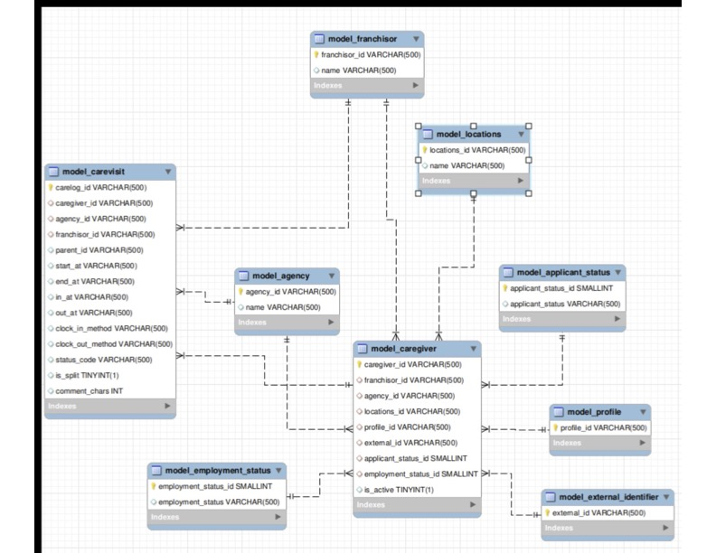

# Zingage Take Home Assignment - Gary Gao

### To start

Install dependencies:

npm install

Create database:

createdb zingage

Configure the postgres environment by editing .env file: 

DATABASE_URL=postgres://[username]@localhost:5432/zingage

### To run the pipeline

Run ddl_init.sql to create the stage tables used to load the CSV data:

npm run db:ddl:init

Run etl/transform.ts to load in the CSV data into the empty stage tables: 

npm run etl

Run ddl_norm.sql to create the normalized schemas and mart schemas w/ analytical columns: 

npm run db:ddl:norm

Run etl/transform_norm.ts to migrate data to the normalized views/tables

npm run etl:norm

Run dml.sql to run analytical queries: 

npm run db:dml

To test queries: 

psql -h localhost -U garygao -d zingage 

To generate result.out

npm run db:dml > result.out      

### Schema Design

 
Note that ERD is created from MySQL

For overall design, I decided to use three separate schemas (stage, model, mart) for the 3 stages of the pipeline. The stage schema directly mirrors the CSV columns. It is used to load the data from CSV into Postgres via ETL. The model schema is normalized, relational, and in third normal form (3NF). Every attribute depends only on its key, there's no duplicates, and we removed all transitive dependencies. Finally, the mart schema contains analytical views and data-engineered columns that are used for analysis querying. 

In the model schema (shown above in ERD), all repeating values or foreign-key attributes are factored out of model_caregiver and model_carevisit into its own dedicated tables to eliminate duplications and transitive dependency. Specifically, agency_id, franchisor_id, and model_locations are pulled out into tables with one row per ID and name. This prevents repeating the same name on multiple caregivers. I also pulled out the status columns by introducing model_employment_status and model_applicant_status so that there are compact foreign keys in model_caregiver. Similarly, profile_id and external_id are also factored out to keep the caregiver table clean and consistent.

### File structure: 

zingage-project/
├─ data/
│  ├─ caregiver_data_20250415_sanitized.csv
│  └─ carelog_data_20250415_sanitized.csv
├─ sql/
│  ├─ ddl_init.sql (creates initial database schemas and stage tables matching CSV)
│  ├─ ddl_norm.sql (normalized database schema according to ERD)
│  └─ dml.sql (the CRUD operations, or the actual sql)
├─ src (or app)/
│  └─ etl/
│     ├─ transform.ts (read, transform, and load row by row with psql transform. )
├─ result.out (analytics output)
├─ README (contains ERD)
├─ .env
└─ package.json

### Workflow 

- Run ddl_init.sql to create initial database schemes and tables to put the CSV information in. 
- Run ETL sequentially, row by row to copy over data into the created database. 
- Run ddl_norm.sql to normalize the database schema into 3NF. Also create the MART tables for analytics. 
- Run ETL norm to migrate the data from stage tables to normalized datables. 
- Run dml.sql to query the database and obtain the answers.   

### Key assumption: 

I assumed that all the datatime fields are already in the correct business time zone and thereby did no conversion. 

Since clock_in_method, clock_out_method, and status are some type of EMR code, I just stored them as text and passed them through the model without any decoding. 

I handeled empty strings as NULL values in order to preserve the 'not provided' sentiment. 

I used the character count as an indication of documentation quality. 

I defined a completed visit as one with both in_at and out_at, out_at > in_at, and actual_mins ≥ 5. 

I treated late arrival as one greater than 10 minutes. 

I defined short-worked as one where actual_mins < 25% * scheduled_mins.

For the duration stat model, I used ignore values < 6 min or > 16 h for summary statistics.

I used interquartile range (IQR) to identify outliers, where they're outside the 10th and 90th percentile. 

I defined working overtime as one where weekly minutes per caregiver in a week is greater than 2400 (40 hours). 

### Tradeoffs

- Introducing IDs for more opaque text IDs like the status adds columns but makes the table more stable.
- Limiting the IQR to 10 percent and 90 percent instead of 25 percent and 75 percent. While I got brevity in my response, I lost potentially helpful information about other anomalies. 
- Using ETL streaming and upserts was also a tradeoff. While I added complexity by parsing CSVs, upserting with transactions, and transforming rows by skipping those wth primary keys relative to a simple insert, I was able to get data of better quality while using less memory. This is especially important with the large dataset that we are dealing with. 

##### NOTES
- stage tables are not shown, but they essentially mirror the CSVs columns for data loading.
- mart views are not shown, but they derive additional analytical attributes such as actual_mins, late_by_mins, reliability rollups, duration stats, outliers, documentation consistency, and overtime. 

