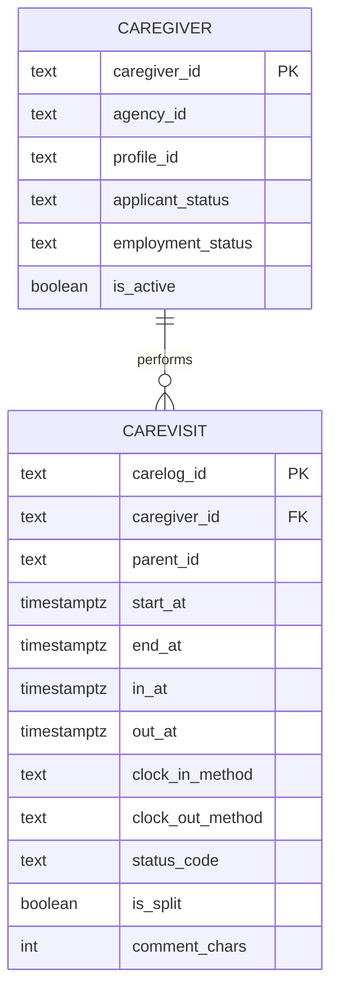

# Database Schema Design

## Entity Relationship Diagram (ERD)



## Schema Normalization

### Current State: **3NF (Third Normal Form)**

#### 1NF ✅ Achieved
- All columns contain atomic values
- Each row is unique (primary keys)
- No repeating groups

#### 2NF ✅ Achieved
- Already in 1NF
- No partial dependencies (single-column primary keys)
- All non-key attributes depend on the entire primary key

#### 3NF ✅ Achieved
- Already in 2NF
- No transitive dependencies
- All attributes depend directly on primary key

## Table Relationships

### model_caregiver (Master Table)
- **Primary Key**: `caregiver_id`
- **Purpose**: Store caregiver profile information
- **Records**: ~1 million unique caregivers

### model_carevisit (Transaction Table)
- **Primary Key**: `carelog_id`
- **Foreign Key**: `caregiver_id` → model_caregiver
- **Purpose**: Store individual care visit records
- **Records**: ~266K visits (after filtering nulls)

### Relationship Type
- **One-to-Many** (1:N)
- One caregiver can have many visits
- Each visit belongs to exactly one caregiver

## Analytical Views Architecture

```
┌──────────────┐
│ Stage Tables │ (Raw CSV data)
└──────┬───────┘
       ▼
┌──────────────┐
│ Model Tables │ (Normalized 3NF)
└──────┬───────┘
       ▼
┌──────────────┐
│  Mart Views  │ (Pre-calculated analytics)
└──────────────┘
```

### Key Mart Views

1. **mart_visit_base**
   - Adds calculated fields (actual_mins, scheduled_mins, late_by_mins)
   - Foundation for all other views

2. **mart_completed_visits**
   - Filters: has clock in/out, duration >5 minutes
   - Used for: Top performer analysis

3. **mart_reliability_by_caregiver**
   - Aggregates: missed, late, short-worked visits
   - Used for: Identifying problem caregivers

4. **mart_duration_stats**
   - Statistics: average, median, 90th percentile
   - Used for: Operational efficiency analysis

5. **mart_duration_outliers**
   - Method: IQR (Interquartile Range)
   - Used for: Finding unusual visit lengths

6. **mart_documentation_consistency**
   - Metrics: detailed notes rate per caregiver
   - Used for: Quality assessment

7. **mart_overtime_by_week**
   - Calculation: weekly hours per caregiver
   - Used for: Labor compliance monitoring

## Index Strategy

### Primary Indexes
- `model_caregiver(caregiver_id)` - Primary key index
- `model_carevisit(carelog_id)` - Primary key index

### Performance Indexes
- `ix_visit_caregiver_time` on `(caregiver_id, start_at)`
  - Optimizes: Caregiver schedule queries
- `ix_visit_inout` on `(in_at, out_at)`
  - Optimizes: Duration calculations

## Data Flow

```
CSV Files → Staging Tables → Model Tables → Mart Views → Analytics
         ETL            Migration      Views        Queries
```

1. **Extract**: Read CSV files
2. **Transform**: Clean data, handle nulls
3. **Load**: Insert into staging tables
4. **Migrate**: Move to normalized model
5. **Analyze**: Query mart views for insights